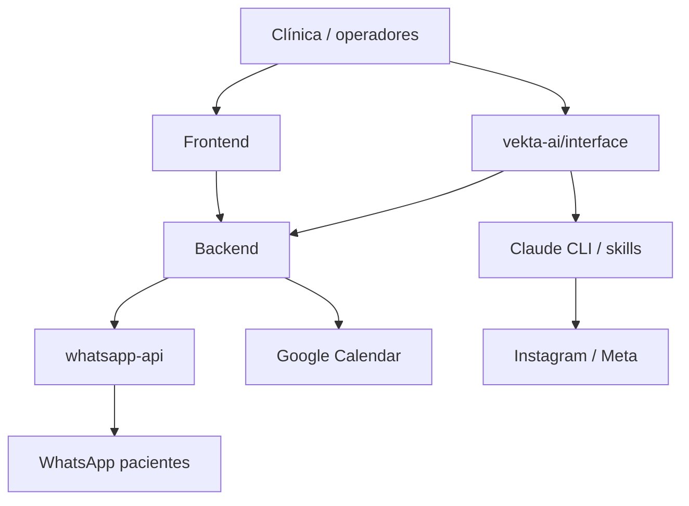

# AGENTS.md — Clínica Sorria Bauru

Instruções para agentes de IA que trabalham neste monorepo.

## Visão geral

Sistema monorepo da **Clínica Sorria Bauru** (odontologia). Reúne CRM, painel web, agentes de IA (Vekta), WhatsApp e integrações de marketing/agenda — tudo orquestrado para operação comercial e atendimento da clínica.

**Integrações e frentes (existentes ou em evolução):**

- Agentes de IA (qualificação de leads, WhatsApp, marketing via Vekta)
- Google Agenda (Calendar) — agendamentos via tools do agent
- Google Ads / Meta Ads — aquisição e mídia
- Instagram (Meta) — conteúdo, análise e canais no CRM
- WhatsApp Web API — sessões, webhooks e atendimento automatizado

**Não misture contextos:** ao editar um pacote, priorize o `AGENTS.md` / README daquela pasta. Este arquivo descreve o monorepo; detalhes de stack ficam nos subprojetos.

## Estrutura principal

```
clinica-sorria-bauru/
├── backend/          # API Laravel (CRM, agents, integrações)
├── frontend/         # App Vue (painel da clínica)
├── vekta-ai/         # Agentes de IA + interface Vekta + DNA da marca
├── whatsapp-api/     # Microserviço WhatsApp Web (Node)
├── deploy/           # Nginx, systemd e setup no host
├── docker-compose*.yml
└── *-deploy.sh
```

| Pasta / arquivo | Papel |
|-----------------|--------|
| `backend/` | Backend em **Laravel** (API). CRM (leads, deals, pipeline), autenticação Sanctum, jobs de WhatsApp/AI, Google Calendar e demais domínios de negócio. PostgreSQL. |
| `frontend/` | Frontend em **Vue 3 + Vite + TypeScript**. Interface da clínica (login, CRM, etc.) consumindo a API do backend. |
| `vekta-ai/` | **Vekta AI** — gerente de operações de IA. Skills/agentes (marketing, Instagram, copy, etc.), pasta `.dna/` com contexto da clínica, interface web/desktop e saídas em `marketing/`, `saidas/`. |
| `whatsapp-api/` | API **Node.js** (whatsapp-web.js + MongoDB) para sessões WhatsApp, webhooks e conexão com o CRM/agents. Tem `AGENTS.md` próprio. |
| `deploy/` | Arquivos de **deploy no servidor**: `nginx/` (server blocks), `systemd/` (unit da interface), `host/` (scripts de setup/run no host). |
| `docker-compose.yml` / `docker-compose.prod.yml` | Orquestração local e produção (Postgres, WhatsApp, backend em prod). |
| `deploy.sh`, `backend-deploy.sh`, `whatsapp-deploy.sh`, `vekta-deploy.sh` | Scripts de redeploy incremental por peça. |
| `redeploy.md` | Runbook de deploy / produção. |

## Como as peças se conectam



- **CRM e agents de atendimento** vivem no `backend/` (Laravel).
- **Marketing e especialistas de IA** vivem no `vekta-ai/` (skills + `.dna`).
- **Canal WhatsApp** é o `whatsapp-api/`, consumido pelo backend.
- **UI da clínica** é o `frontend/`; a UI do hub de agentes é `vekta-ai/interface/`.

## Convenções do monorepo

- Alterações **focadas** no pacote pedido; não refatorar outros serviços “de passagem”.
- Credenciais só em `.env` (nunca commitados). Exemplos em `*.env.example`.
- Antes de mudar contrato entre serviços (webhooks WhatsApp, tokens Sanctum, payloads CRM), verificar impacto no consumidor.
- Commits e push **somente** se o usuário pedir explicitamente.
- Preferir o idioma do código/docs existentes em cada pasta (PT no domínio da clínica; EN técnico quando já estiver assim).

## Onde aprofundar

| Área | Documento |
|------|-----------|
| Visão geral e como subir o stack | [`README.md`](README.md) |
| API CRM / Laravel | [`backend/AGENTS.md`](backend/AGENTS.md), [`backend/README.md`](backend/README.md) |
| Frontend Vue | [`frontend/AGENTS.md`](frontend/AGENTS.md) |
| WhatsApp API | [`whatsapp-api/AGENTS.md`](whatsapp-api/AGENTS.md) |
| Vekta AI / skills / DNA | [`vekta-ai/README.md`](vekta-ai/README.md), [`vekta-ai/CLAUDE.md`](vekta-ai/CLAUDE.md) |
| Deploy / produção | [`redeploy.md`](redeploy.md), pasta [`deploy/`](deploy/) |
