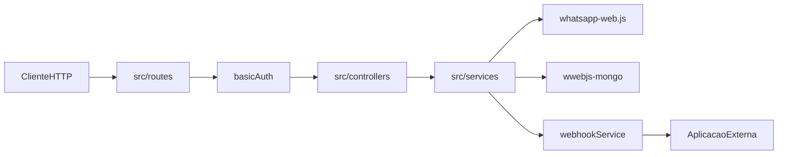

# AGENTS.md — WhatsApp Web API

Instruções para agentes de IA que trabalham neste repositório.

## Comandos

```bash
npm install
cp env.example .env
npm run dev          # desenvolvimento (nodemon)
npm start            # produção
docker compose up --build -d
node test-whatsapp.js
```

- Pré-requisito: MongoDB rodando (`MONGODB_URI` no `.env`; no Docker, definido em `docker-compose.yml`).
- API padrão: `http://localhost:3000` (porta via `PORT`).
- Teste visual: abrir `qr-viewer.html` no navegador.

## Visão geral

Microserviço Node.js que expõe uma API REST para conectar múltiplas sessões do WhatsApp Web, persistir sessões no MongoDB e disparar webhooks para aplicações externas.

**Stack:** Node.js (CommonJS), Express 4, whatsapp-web.js (GitHub `main`), wwebjs-mongo, Mongoose, MongoDB GridFS, axios, dotenv.

**Ponto de entrada:** `index.js` → `src/app.js`

## Arquitetura



| Pasta | Responsabilidade |
|-------|------------------|
| `src/routes/` | Definição de endpoints Express |
| `src/controllers/` | Validação HTTP, status codes, delegação aos services |
| `src/services/` | Lógica de negócio (WhatsApp, webhooks) |
| `src/config/` | MongoDB, MongoStore, modelos |
| `src/middlewares/` | Basic Auth |
| `src/utils/` | Helpers (ex.: formatação de telefone) |

**Regra de ouro:** nova lógica de negócio vai em `services/`; controllers permanecem finos.

## Domínio WhatsApp

- Sessões identificadas por `sessionId`; clientes mantidos em memória (`Map`) em `src/services/whatsappService.js`.
- Autenticação de sessão: `RemoteAuth` + MongoStore (`wwebjs-mongo`), com `dataPath` em `sessions/`.
- Restauração automática na inicialização (`AUTO_RESTORE_SESSIONS`, `RESTORE_DELAY` em `env.example`).
- Webhooks por sessão: `notifications_url` / `messages_url` no `POST /api/whatsapp/connect`; tipos em `src/services/webhookService.js`. No evento `message`, `data` inclui `jid` (primário), `phone_number` e `contact_name` via `message.getContact()`.
- Rotas protegidas por Basic Auth (`BASIC_AUTH_USERNAME` / `BASIC_AUTH_PASSWORD`); prefixo base: `/api/whatsapp/*`.

## Convenções de código

- **Módulos:** CommonJS (`require` / `module.exports`), sem ESM.
- **Nomenclatura:** camelCase para arquivos e funções; PascalCase para classes (`WhatsAppService`, `WhatsAppController`).
- **Respostas da API:** formato `{ success: boolean, ... }` com status HTTP adequado.
- **Organização:** um arquivo por responsabilidade; reexportar via `index.js` em cada pasta quando aplicável.
- **Comentários:** apenas para lógica não óbvia.
- **Escopo:** alterações focadas; não refatorar código não relacionado.

Exemplo de padrão correto:

```javascript
const result = await whatsappService.createConnection(sessionId, urlWebhook);
return res.status(result.success ? 201 : 500).json(result);
```

## Variáveis de ambiente

| Variável | Uso |
|----------|-----|
| `PORT` | Porta do servidor |
| `BASIC_AUTH_USERNAME` / `BASIC_AUTH_PASSWORD` | Auth da API |
| `MONGODB_URI` | Persistência de sessões |
| `AUTO_RESTORE_SESSIONS` | Restaurar sessões ao subir (padrão: true) |
| `RESTORE_DELAY` | Delay em ms antes da restauração (padrão: 5000) |

Detalhes em `env.example`.

## Guardrails

### Sempre

- Respeitar a separação routes → controllers → services.
- Manter Basic Auth nas rotas `/api/whatsapp`.
- Usar variáveis de ambiente para credenciais e URLs sensíveis.
- Testar mudanças com `npm run dev` e, quando relevante, `node test-whatsapp.js` ou `qr-viewer.html`.

### Perguntar antes

- Alterar estratégia de autenticação de sessão (`RemoteAuth` vs `LocalAuth`).
- Mudar formato dos payloads de webhook (impacta integradores externos).
- Atualizar dependência `whatsapp-web.js` (vem do GitHub `main`, pode quebrar comportamento).
- Alterar `docker-compose.yml` (rede externa `chatbot` é dependência de deploy).

### Nunca

- Commitar `.env`, credenciais ou dados de `sessions/`.
- Modificar sessões WhatsApp diretamente no MongoDB sem entender o MongoStore/GridFS.
- Criar commits ou push sem solicitação explícita do usuário.
- Adicionar documentação markdown não solicitada.

## Referências

- [`README.md`](README.md) — visão geral e como rodar
- [`swagger.json`](swagger.json) — contrato completo da API
- [`src/README.md`](src/README.md) — convenções de pastas do código-fonte
- [`env.example`](env.example) — variáveis de ambiente
