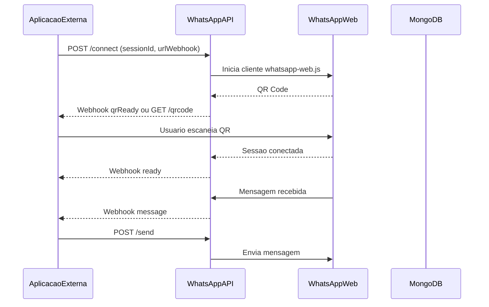

# WhatsApp Web API

Microserviço Node.js + Express que integra WhatsApp Web com outros sistemas. Permite conectar múltiplas contas simultaneamente, cada uma identificada por um `sessionId`, e notificar aplicações externas via webhooks.

**Stack:** Node.js, Express, whatsapp-web.js, MongoDB.

## Como funciona

1. Sua aplicação chama `POST /api/whatsapp/connect` informando `sessionId` e `urlWebhook`.
2. A API inicia um cliente whatsapp-web.js e gera um QR Code.
3. O QR é enviado via webhook (`qrReady`) ou consultado em `GET /api/whatsapp/qrcode/:sessionId`.
4. Após o usuário escanear o QR, a sessão fica conectada e um webhook `ready` é disparado.
5. Mensagens recebidas são enviadas ao `urlWebhook` da sessão; mensagens de saída via `POST /api/whatsapp/send/:sessionId`.



- Sessões persistidas no MongoDB (RemoteAuth + MongoStore).
- Restauração automática de sessões ao reiniciar o servidor.
- API protegida por Basic Auth em todas as rotas `/api/whatsapp/*`.
- Webhooks configurados por sessão no momento da conexão.

## Webhooks

No `POST /api/whatsapp/connect`, informe:

| Campo | Uso |
|-------|-----|
| `data.notifications_url` | Eventos de sessão (`qr_code`, `authenticated`, `ready`, `disconnected`, `error`) |
| `data.messages_url` | Mensagens recebidas (`message`) |

Envelope comum:

```json
{
  "event": "message",
  "session_id": "user123",
  "data": { }
}
```

### Evento `message`

Contato resolvido via `message.getContact()` (whatsapp-web.js):

| Campo | Origem | Descrição |
|-------|--------|-----------|
| `jid` | `contact.id._serialized` | Identificador primário do contato |
| `phone_number` | `contact.id.user` (se JID `@c.us`) | Número limpo; `contact.number` pode ser LID interno |

| `contact_name` | agenda / pushname / notifyName (ignora se for o próprio número) | Nome real do contato |

Exemplo:

```json
{
  "event": "message",
  "session_id": "user123",
  "data": {
    "jid": "5511999999999@c.us",
    "phone_number": "5511999999999",
    "contact_name": "João Silva",
    "body": "Olá!",
    "has_media": false,
    "is_view_once": false,
    "is_group": false,
    "message_id": "true_5511999999999@c.us_3EB0ABCDEF",
    "type": "chat",
    "timestamp": 1718123456
  }
}
```

### Evento `ready`

```json
{
  "event": "ready",
  "session_id": "user123",
  "data": {
    "phone_number": "5511888888888"
  }
}
```

## Enviar mensagem

`POST /api/whatsapp/send/:sessionId` — o campo `to` deve ser o **JID** do destinatário (o mesmo `jid` do webhook `message`), não só o número:

```json
{
  "to": "5511999999999@c.us",
  "message": "Olá!"
}
```

## Como rodar

### Pré-requisitos

Node.js e MongoDB (local ou via Docker).

### Local

```bash
npm install
cp env.example .env
npm run dev
```

Edite o `.env` com as variáveis essenciais:

| Variável | Descrição |
|----------|-----------|
| `PORT` | Porta do servidor (padrão: 3000) |
| `BASIC_AUTH_USERNAME` | Usuário da API |
| `BASIC_AUTH_PASSWORD` | Senha da API |
| `MONGODB_URI` | URL de conexão com o MongoDB |

API disponível em `http://localhost:3000`.

### Docker

```bash
cp env.example .env
docker compose up --build -d
```

O `docker-compose.yml` configura o `MONGODB_URI` automaticamente. Defina `BASIC_AUTH_USERNAME` e `BASIC_AUTH_PASSWORD` no `.env`.

Para parar: `docker compose down`.

### Teste rápido

Abra `qr-viewer.html` no navegador para conectar uma sessão visualmente.

## Mais informações

- Contrato da API: [`swagger.json`](swagger.json)
- Instruções para agentes de IA: [`AGENTS.md`](AGENTS.md)
