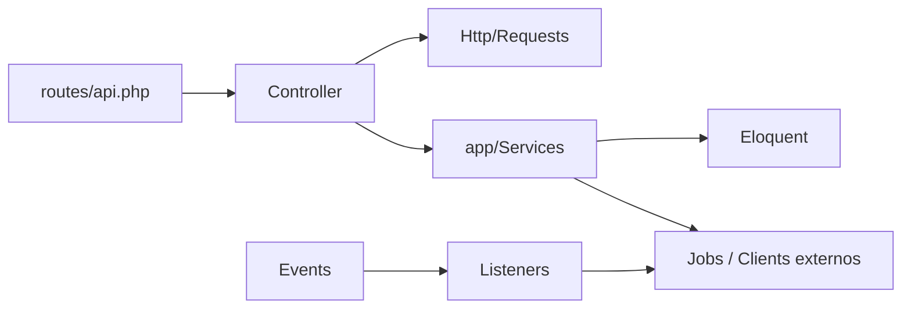

# AGENTS.md — Backend (Laravel)

Instruções para agentes de IA que trabalham neste pacote.

## Comandos

```bash
composer install
cp .env.example .env          # preencher DB_* e APP_KEY
php artisan key:generate
php artisan migrate --seed
php artisan serve             # http://localhost:8000
php artisan queue:work        # necessário para agent WhatsApp e campanhas
php artisan test
```

- Postgres: `docker compose up -d postgres` na **raiz do monorepo** (ou local na 5432).
- Seed imprime usuário Admin + senha + token Sanctum `interface` **uma vez** — copiar para `BACKEND_API_TOKEN` em `vekta-ai/interface/.env`.
- Docs interativas: `GET /docs` (Swagger em `swagger.json`).

## Visão geral

API Laravel **sem frontend** (sem Blade/Vite/npm). Concentra o domínio de negócio da Clínica Sorria Bauru / Vekta: CRM, agents de WhatsApp, Google Calendar, campanhas e financeiro.

**Stack:** Laravel 12, PHP 8.2+, PostgreSQL 16, Sanctum (Bearer), queue `database`.

**Consumidores:** `frontend/`, `vekta-ai/interface/`, webhooks do `whatsapp-api/`.

## Arquitetura MVP (Services)

Padrão do projeto — **controllers só validam e direcionam; Services fazem tudo**:



| Camada | Responsabilidade | Onde |
|--------|------------------|------|
| Routes | Prefixo `/api/v1`, middleware, binding | `routes/api.php` |
| Controllers | Só valida (Form Request) e direciona ao Service; monta o JSON/status | `app/Http/Controllers/Api/{Auth,Crm,Finance}` |
| Form Requests | Validação e autorização de input | `app/Http/Requests/{Auth,Crm,Finance}` |
| **Services** | **Toda a lógica** (CRUD incluso) — Eloquent, regras, transações | `app/Services/{Crm,Finance}` |
| Models | Persistência Eloquent | `app/Models` e `app/Models/{Crm,Finance}` |
| Jobs | Trabalho assíncrono (queue) | `app/Jobs/Crm` |
| Events / Listeners | Side-effects (WhatsApp inbound → AI) | `app/Events/Crm`, `app/Listeners/Crm` |

### Regra de ouro

- **Tudo vai para o Service** (método `handle(...)`) — inclusive CRUD simples (`create`, `update`, `delete`, listagens com filtros).
- **Controller não acessa Eloquent** nem aplica regra de domínio: só recebe o Form Request, chama o Service e devolve `response()->json(...)`.
- Fluxo obrigatório: Form Request → Service → JSON.
- **Não** criar API Resources, Actions nem Policies neste MVP — o projeto responde JSON manual e usa Sanctum + `role` pontual.

Exemplo já usado:

```php
// Controller
public function convert(ConvertLeadRequest $request, Lead $lead, ConvertLead $converter): JsonResponse
{
    $deal = $converter->handle($lead, $request->validated(), $request->user()?->id);

    return response()->json(['data' => $deal], 201);
}
```

```php
// Service — App\Services\Crm\ConvertLead
public function handle(Lead $lead, array $attrs = [], ?int $userId = null): Deal
{
    // validações de domínio, DB::transaction, side-effects...
}
```

### Onde colocar o quê

| Tipo de lógica | Destino |
|----------------|---------|
| Qualquer caso de uso / CRUD (listar, criar, atualizar, excluir, converter, mover…) | `app/Services/{Dominio}/NomeDoCaso.php` com `handle()` |
| Cliente HTTP externo (WhatsApp API, OpenRouter, Google) | `app/Services/Crm/*Client.php` |
| Tool do agent LLM | `app/Services/Crm/Agent/Tools/*Tool.php` |
| Trabalho longo / AI / campanha | `app/Jobs/Crm/*Job.php` + `ShouldQueue` |
| Schema / relações | Eloquent Model + migration (sem regra de negócio no Model) |

Nomes de Service: verbo/substantivo do caso (`ConvertLead`, `MoveLead`, `CreateFinancialEntry`, `ActivateAgent`) — **não** `LeadService` genérico.

## Estrutura de pastas

```
backend/
├── app/
│   ├── Http/Controllers/Api/{Auth,Crm,Finance}
│   ├── Http/Requests/{Auth,Crm,Finance}
│   ├── Http/Middleware/          # EnsureUserHasRole (alias role)
│   ├── Models/{Crm,Finance}
│   ├── Services/{Crm,Finance}    # MVP: coração do domínio
│   │   └── Crm/Agent/            # runner + tools do WhatsApp AI
│   ├── Jobs/Crm/
│   ├── Events/Crm/ + Listeners/Crm/
│   └── Providers/
├── routes/api.php                # /api/v1/*
├── database/{migrations,seeders,factories}
├── tests/Feature/                # preferir Feature com RefreshDatabase
├── docker/                       # entrypoint (app | queue), nginx
└── swagger.json
```

## API e auth

- Prefixo: **`/api/v1`** (`auth`, `users`, `crm`, `finance`).
- Auth: Sanctum Bearer (`Authorization: Bearer {token}`). Login: `POST /api/v1/auth/login`.
- Admin de usuários: middleware `role:admin` em `/api/v1/users`.
- Webhooks WhatsApp **públicos** (sem Sanctum):  
  `POST /api/v1/crm/whatsapp/webhooks/{notifications,messages}` — auth por `?token=` = `connections.webhook_token`.
- Contexto multi-clínica: header `X-Clinic-Id` (middleware `clinic`) nas rotas CRM/finance autenticadas. Funcionário usa `users.clinic_id`; admin pode trocar.
- Sessão WhatsApp da clínica: `/api/v1/crm/connection/*` (1:1 com `clinics`).
- Respostas: `{ "data": ... }` (listas paginadas = paginator Laravel). Validação: `422` com `{ message, errors }`.
- Mensagens de erro/validação em **português**.

## Domínios principais

| Domínio | Entrada | Services / peças-chave |
|---------|---------|-------------------------|
| CRM | `/api/v1/crm/*` | `ConvertLead`, `MoveLead`, models Lead/Deal/Contact… |
| WhatsApp | webhooks + `ConnectionController` / chats | `WhatsappApiClient`, `ProcessInboundWhatsappMessage`, `WhatsappLeadResolver` |
| Agent IA | queue após inbound | `WhatsappAgentRunner`, `OpenRouterAgentClient`, tools (agendar, mover, responder…) |
| Google Calendar | tools do agent | `GoogleCalendarClient` + env `GOOGLE_*` |
| Campanhas | `/crm/whatsapp/campaigns` | `RunWhatsappCampaignJob`, `ParseCampaignCsv`, `RenderCampaignMessage` |
| Finance | `/api/v1/finance/*` | `CreateFinancialEntry` |

Fluxo WhatsApp → AI (não quebrar):

`WhatsappInboundMessageReceived` → persist → `WhatsappMessageStored` → `ProcessWhatsappAiReplyJob` → `WhatsappAgentRunner`.

## Convenções Laravel (boas práticas deste repo)

- **Migrations** versionadas; não editar migration já aplicada em prod — criar outra.
- **Eager load** relações usadas na resposta (`with`) para evitar N+1.
- **Route model binding** (`{lead}`, `{deal}`) — manter nomes consistentes com o Model.
- **Form Request** obrigatório em POST/PATCH com body; não validar com `$request->validate()` no controller salvo exceção pontual.
- Injeção de dependência no method/constructor do controller ou Service (container Laravel).
- Transações (`DB::transaction`) dentro do Service quando houver múltiplos writes.
- Jobs: `ShouldQueue`; worker local/prod obrigatório para AI e campanhas.
- Testes: Feature + `RefreshDatabase` + `Sanctum::actingAs()`; DB de teste = sqlite `:memory:` (`phpunit.xml`).
- Escopo: mudanças focadas; sem refatoração cosmética em arquivos não relacionados.

## Variáveis de ambiente relevantes

| Grupo | Variáveis |
|-------|-----------|
| App / DB | `APP_KEY`, `APP_URL`, `DB_*` |
| Queue | `QUEUE_CONNECTION=database` |
| WhatsApp | `WHATSAPP_API_URL` |
| LLM | `OPENROUTER_API_KEY`, `OPENROUTER_AGENT_MODEL` |
| Calendar | `GOOGLE_CLIENT_ID`, `GOOGLE_CLIENT_SECRET`, `GOOGLE_CALENDAR_*` |

Detalhes em `.env.example`. Nunca commitar `.env`.

## Guardrails

### Sempre

- Toda lógica (incluindo CRUD) em **Services** com `handle()`; controller só valida e direciona.
- Manter contrato JSON `{ data }` e prefixo `/api/v1`.
- Preservar token Sanctum nomeado `interface` (logout-all / troca de senha não devem apagá-lo).
- Rodar `php artisan test` ao mudar CRM, auth, WhatsApp agent ou finance.
- Usar queue para AI/campanhas — não processar LLM síncrono no request HTTP.

### Perguntar antes

- Alterar payload/contrato dos webhooks WhatsApp ou das tools do agent.
- Mudar auth (Sanctum, roles, token `interface`).
- Remover/renomear colunas usadas pelo frontend ou pela interface Vekta.
- Alterar `docker/entrypoint.sh` ou comportamento de migrate em prod.

### Nunca

- Commitar secrets, `.env` ou dumps com dados reais de pacientes.
- Exigir Sanctum nos webhooks WhatsApp.
- Usar Eloquent ou regra de domínio no Controller; engordar Models com casos de uso.
- Criar commits/push sem pedido explícito do usuário.
- Adicionar docs markdown não solicitadas.

## Referências

- [`README.md`](README.md) — setup e mapa CRM
- [`routes/api.php`](routes/api.php) — contrato HTTP
- [`swagger.json`](swagger.json) — OpenAPI
- [AGENTS.md da raiz](../AGENTS.md) — monorepo
- [`whatsapp-api/AGENTS.md`](../whatsapp-api/AGENTS.md) — microserviço WhatsApp
