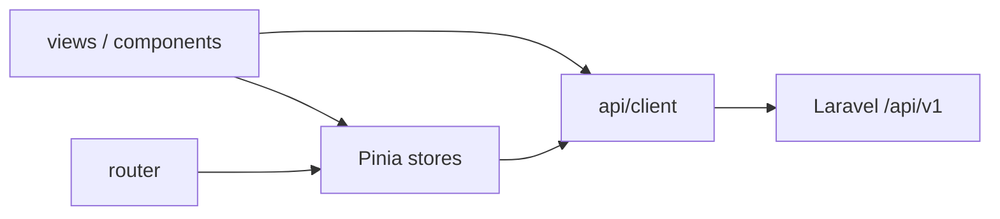

# AGENTS.md — Frontend (Vue)

Instruções para agentes de IA que trabalham neste pacote.

## Comandos

```bash
npm install
cp .env.example .env          # VITE_API_BASE_URL=/api
npm run dev                   # http://localhost:5173 (proxy /api → :8000)
npm run build                 # type-check + vite build
npm run type-check
npm run format
```

- Pré-requisito: backend Laravel em `http://localhost:8000` (ou ajuste o proxy / `VITE_API_BASE_URL`).
- Node: `^22.18.0 || >=24.12.0`.

## Visão geral

SPA da **Clínica Sorria Bauru** — painel web que consome a API em `backend/` (`/api/v1`).

**Stack:** Vue 3.5 + Vite 8 + TypeScript, Vue Router 5, Pinia 4, Axios, Tailwind CSS 4 (`@tailwindcss/vite`), Iconify (`@iconify/vue`).

**Ponto de entrada:** `src/main.ts` → `App.vue` → `<RouterView />`.

## Estrutura

```
frontend/src/
├── api/client.ts       # Axios + ApiError + Bearer token
├── assets/main.css     # Tailwind, tokens de marca, CSS excepcional
├── router/index.ts     # Rotas + guards (auth e roles)
├── stores/             # Pinia (auth, etc.)
├── views/              # Páginas (lazy import nas rotas)
├── components/         # UI por categoria (Buttons/, Layout/, Modals/)
├── App.vue
└── main.ts
```

Marca/static: `public/brand/`. Alias `@/` → `src/`.

## Arquitetura



| Camada | Responsabilidade |
|--------|------------------|
| `views/` | Páginas ligadas a rotas |
| `components/` | UI reutilizável |
| `stores/` | Estado e ações de domínio (auth, etc.) |
| `api/client.ts` | HTTP, token, erros tipados |
| `router/` | Rotas, `meta`, guards |

## UI — Tailwind e CSS próprio

**Sempre usar Tailwind** (classes utilitárias + tokens do `@theme` em `assets/main.css`).

Tokens de marca já definidos:

- `brand-blue` (`#0708f8`), `brand-cyan` (`#00e1ff`), `brand-cyan-ink`, `brand-ink`
- Fonte: Poppins (`font-sans`)

**CSS próprio só em casos bem específicos**, quando:

1. o resultado **não é possível** só com Tailwind, ou
2. forem necessárias **animações complexas** (além do que utilities/`@utility` cobrem).

Nesses casos, preferir `assets/main.css` (`@utility`, `@keyframes`, `@layer`) — evitar `<style>` solto em cada SFC sem motivo. Respeitar `prefers-reduced-motion`.

**Não** criar folhas CSS paralelas por página “por hábito”.

## Ícones — Iconify

**Sempre** usar `@iconify/vue`:

```vue
<script setup lang="ts">
import { Icon } from '@iconify/vue'
</script>

<template>
  <Icon icon="lucide:eye" class="size-5" aria-hidden="true" />
</template>
```

- Preferir set **`lucide:`** (já usado no login), salvo necessidade clara de outro set.
- **Não** usar SVGs inline de ícones genéricos, font-icons nem bibliotecas alternativas.

## Rotas e roles (`admin` | `funcionario`)

Roles da API: `'admin' | 'funcionario'` (`stores/auth.ts`).

**Sempre validar** se uma rota é de:

| Escopo | Quem acessa |
|--------|-------------|
| `admin` | só admin |
| `funcionario` | só funcionario |
| `ambos` | admin **e** funcionario (autenticados) |

### Ao criar ou alterar rota

1. Definir `meta` explícito — nunca deixar ambíguo.
2. Exemplo de convenção:

```ts
meta: {
  requiresAuth: true,
  roles: ['admin'],                    // só admin
  // roles: ['funcionario'],           // só funcionario
  // roles: ['admin', 'funcionario'],  // ambos
}
```

3. O `beforeEach` deve:

- exigir login se `requiresAuth`;
- se `meta.roles` existir, checar `auth.user?.role` contra a lista;
- negar (redirect home/login ou 403) se a role não bater.

4. Rotas `guest` (ex.: login): só visitantes; autenticado redireciona para a home.

5. UI sensível a role: usar `auth.isAdmin` / `user.role` para **esconder** ações — a **fonte de verdade** continua sendo o backend (`role:admin`, Sanctum). Frontend sem check de role ≠ segurança.

Hoje o guard cobre auth/guest; **roles em `meta` + enforcement no guard são obrigatórios** em toda rota nova ou existente ao evoluir o app.

## Auth e API

- Token: `localStorage` `sorria.auth.token` / `sorria.auth.user`.
- Clínica ativa: `localStorage` `sorria.activeClinicId`; Axios injeta header `X-Clinic-Id` em [`api/client.ts`](src/api/client.ts).
- Store Pinia `clinics` + switcher no `AppShellLayout` (admin). Funcionário fica na própria `user.clinic_id`.
- Axios em `api/client.ts` injeta `Authorization: Bearer …`.
- Login: `POST /v1/auth/login` com body `{ user, password }` (campo **`user`**, não `username`).
- Base URL: `VITE_API_BASE_URL` (default `/api`); proxy Vite `/api` → `localhost:8000`.
- Erros: `toApiError` / `ApiError` (mensagens PT quando vierem da API).
- WhatsApp da clínica: view `/whatsapp` → `/v1/crm/connection/*`.

## Convenções

- SFCs com `<script setup lang="ts">`.
- Imports com `@/`.
- Textos de UI e erros em **português**.
- Rotas lazy: `() => import('@/views/...')`.
- Prettier do repo (sem `;`, aspas simples).
- Escopo focado; sem refatorar arquivos não relacionados.
- Dependências como `gsap` / `reka-ui` / `vuedraggable`: usar só quando a feature pedir; não adicionar UI libs novas sem necessidade.

## Guardrails

### Sempre

- Estilizar com **Tailwind**; CSS custom só se Tailwind não resolver ou animação complexa exigir.
- Ícones com **Iconify** (`@iconify/vue`).
- Declarar e validar **role** de cada rota (`admin`, `funcionario` ou ambos).
- Tipar props/estado relevante; rodar `npm run type-check` em mudanças estruturais.
- Tratar erros de API via `toApiError`.

### Perguntar antes

- Mudar contrato de auth (keys do `localStorage`, shape do `user`, campo `user` no login).
- Trocar biblioteca de UI/ícones/CSS.
- Remover proxy `/api` ou alterar fluxo de token.

### Nunca

- Commitar `.env` ou tokens.
- Confiar só no frontend para autorização (backend deve rejeitar).
- Adicionar CSS global “por página” sem esgotar Tailwind.
- Criar commits/push sem pedido explícito do usuário.

## Referências

- [`src/router/index.ts`](src/router/index.ts) — rotas e guards
- [`src/stores/auth.ts`](src/stores/auth.ts) — sessão e roles
- [`src/api/client.ts`](src/api/client.ts) — HTTP
- [`src/assets/main.css`](src/assets/main.css) — Tailwind + tokens
- [AGENTS.md da raiz](../AGENTS.md) — monorepo
- [`backend/AGENTS.md`](../backend/AGENTS.md) — API Laravel
